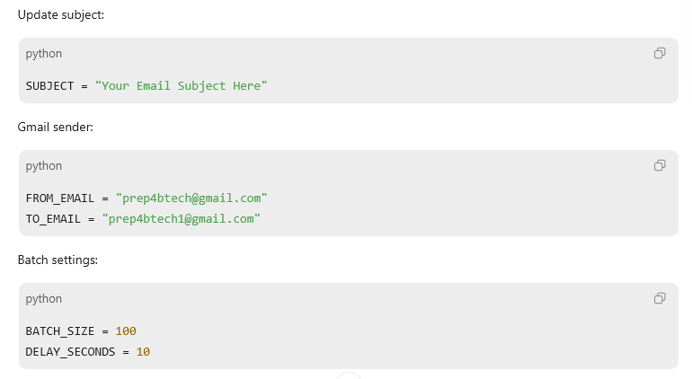
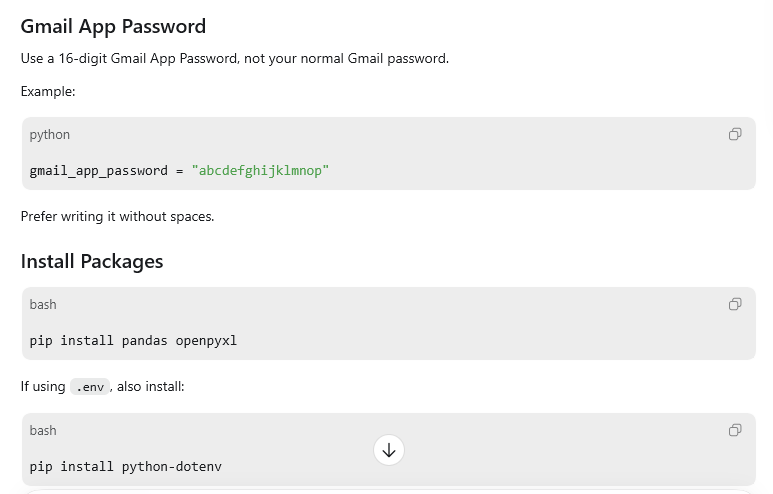
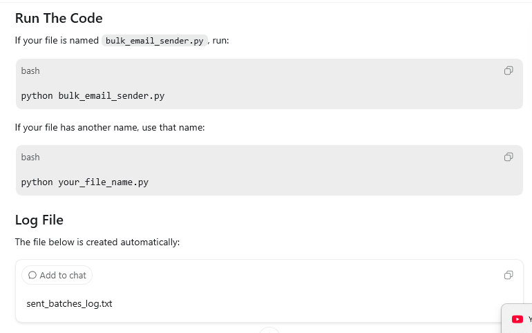

## Python-Bulk-Mail-Code-BCC-100
This project is built to automate the bulk email sending process for promotional activities.
Instead of writing and sending the same email again and again manually, this Python-based project makes the process simple, automated, faster, and easier to manage.
The main purpose of this project is to save time, reduce manual effort, avoid repeated work, and make promotional email communication more efficient and organized

## This project sends bulk emails from an Excel sheet using Gmail SMTP.
## Features
Reads student email addresses from an Excel file using the email column.
Validates email format before sending and skips invalid emails without stopping the program.
Sends emails in BCC batches of 100, including the final batch even if fewer than 100 emails are left.
Waits 10 seconds between each batch to make the sending process controlled.
Prints sent/rejected email status in the terminal and automatically create text file and saves all details in sent_batches_log.txt. 

## Required Excel Format
Your Excel file must contain an `email` column.
## Example:
columns in Excel sheet ---> | name | email |

| Rahul | rahul@example.com |,
| Priya | priya@example.com |

## Important Code Settings
## Update the Excel path:
EXCEL_FILE_PATH = r"C:\Users\YourName\Desktop\students.xlsx"

## Update Subject, To, From details and Batch settings

## Install dependencies and Gmail App Password 

## Run The Code

